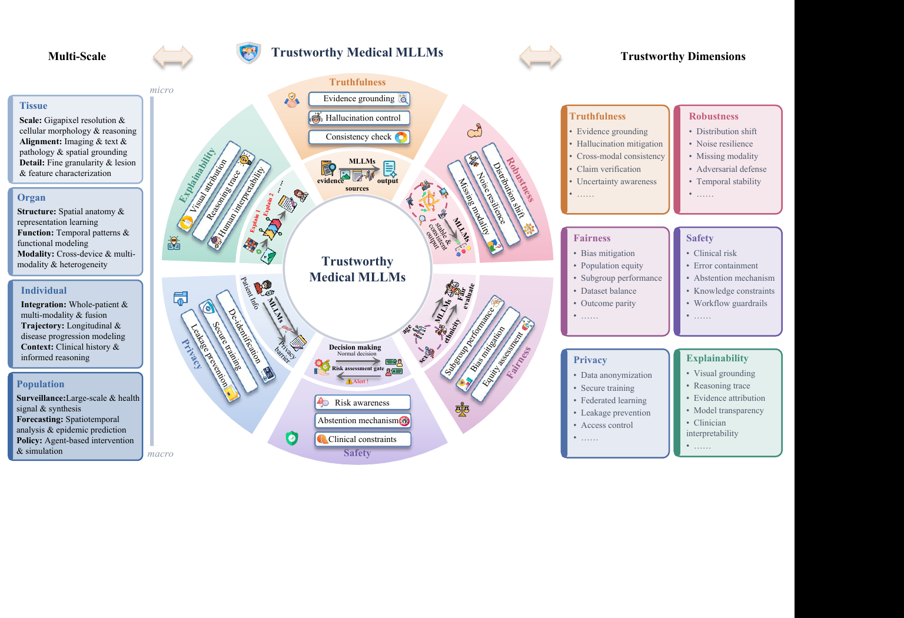
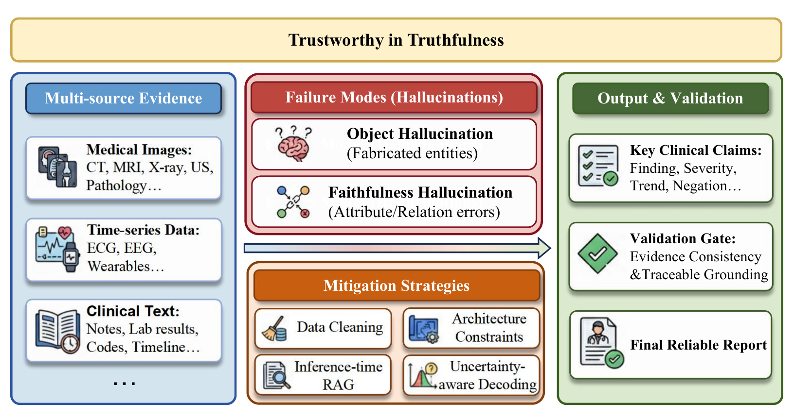
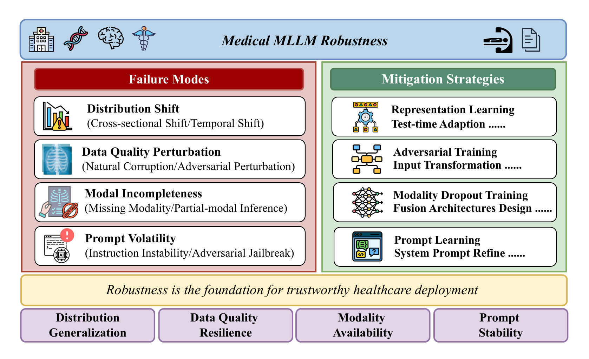
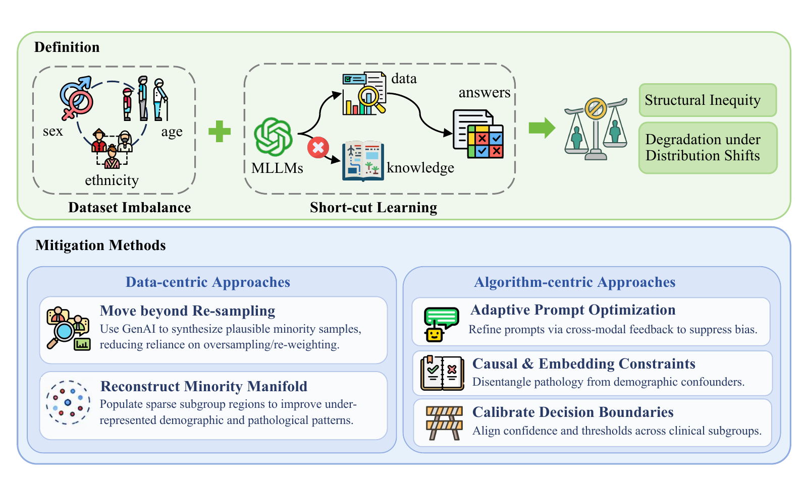
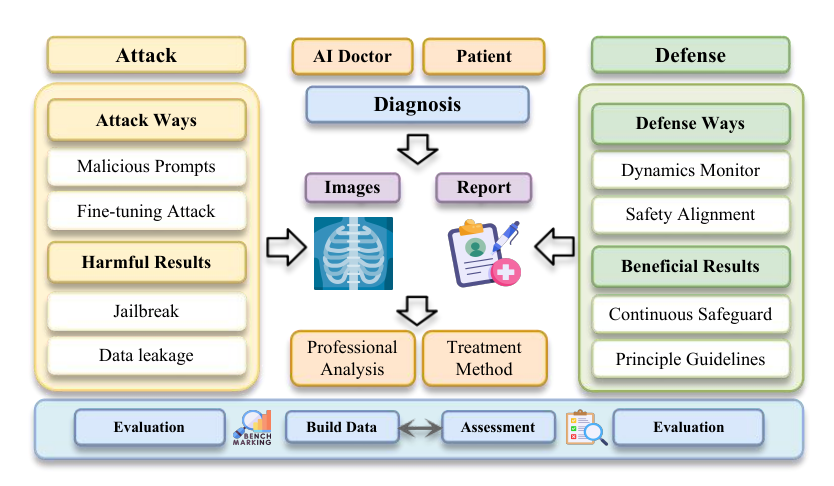
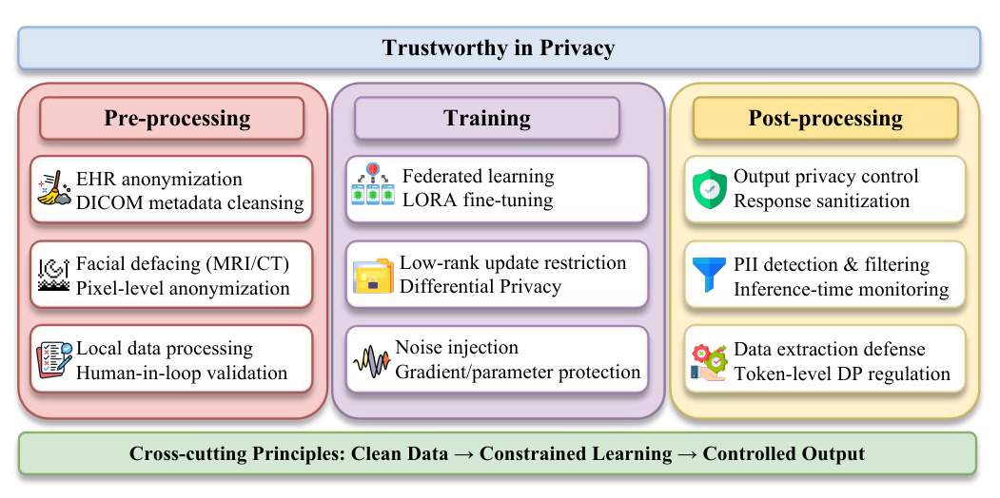
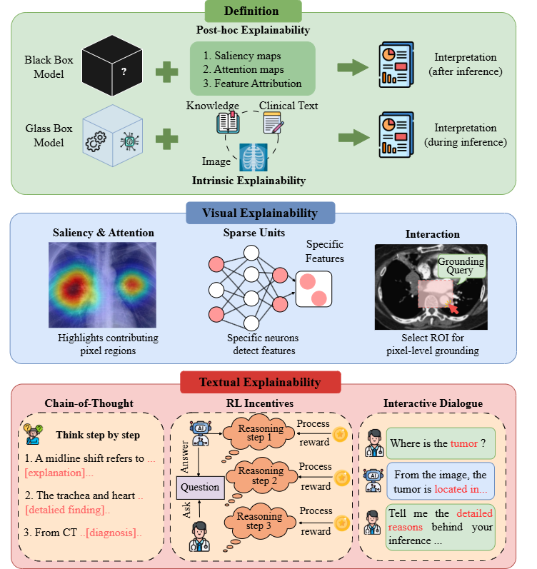

<div align="center">

<p>
  
</p>

# Trustworthy Medical Multimodal Large Language Models: A Survey of Taxonomy, Evaluation, and Benchmark

<p><strong>Official Repository for the Survey Paper</strong><br/><sub>Paper resources · structured taxonomy · curated literature · evaluation protocols</sub></p>

<p>
  
  <a href="https://github.com/junyuanM/Trustworthy-Medical-MLLMs-Survey/pulls"></a>
  
  
  
  
</p>

<p>
  <a href="#1-clinical-landscape"></a>
  <a href="#2-trustworthiness"></a>
  <a href="#3-evaluation-and-benchmark"></a>
  <a href="#4-resources"></a>
</p>

<p><sub><a href="#about-this-list">About</a> · <a href="#taxonomy">Taxonomy</a> · <a href="#1-clinical-landscape">Clinical Landscape</a> · <a href="#2-trustworthiness">Trustworthiness</a> · <a href="#3-evaluation-and-benchmark">Evaluation</a> · <a href="#how-to-contribute">Contribute</a></sub></p>

</div>

This is the official companion repository for **“Trustworthy Medical Multimodal Large Language Models: A Survey of Taxonomy, Evaluation, and Benchmark.”** It connects **four clinical scales** with **six trustworthiness dimensions** and the evaluation protocols needed to study them. The paper link and formal citation will be added when the preprint is publicly released.

## Maintainers

<p align="center">
  <a href="https://github.com/qklee-lz"><br/><strong>Qiankun Li</strong></a>
  &nbsp;&nbsp;&nbsp;&nbsp;
  <a href="https://github.com/junyuanM"><br/><strong>Junyuan Mao</strong></a>
</p>

## 📢 News

- **[2026-08-10]** 🖼️ Published the complete seven-figure survey framework: overview plus six trustworthiness dimensions.
- **[2026-08-10]** ✨ Established the official paper repository with a clear visual identity, quick navigation, and a contribution-ready taxonomy.
- **[2026-08-10]** 🎉 Released the initial public list with curated seed papers, evaluation resources, and validation rules.

## Table of Contents

<details open>
<summary><strong>Browse the list</strong></summary>

- [Maintainers](#maintainers)
- [About This List](#about-this-list)
  - [At a Glance](#at-a-glance)
  - [Scope and Inclusion Boundary](#scope-and-inclusion-boundary)
  - [Curation Principles](#curation-principles)
- [Taxonomy](#taxonomy)
- [1. Clinical Landscape](#1-clinical-landscape)
  - [1.1 Tissue Scale](#11-tissue-scale)
  - [1.2 Organ Scale](#12-organ-scale)
  - [1.3 Individual Scale](#13-individual-scale)
  - [1.4 Population Scale](#14-population-scale)
- [2. Trustworthiness](#2-trustworthiness)
  - [2.1 Dimension Frameworks](#21-dimension-frameworks)
  - [2.2 Trustworthiness Methods and Resources](#22-trustworthiness-methods-and-resources)
- [3. Evaluation and Benchmark](#3-evaluation-and-benchmark)
- [4. Resources](#4-resources)
- [How to Contribute](#how-to-contribute)
- [Citation](#citation)
- [License](#license)

</details>

## About This List

**In this section:** [At a Glance](#at-a-glance) · [Scope and Inclusion Boundary](#scope-and-inclusion-boundary) · [Curation Principles](#curation-principles)

Medical MLLMs combine language with one or more clinically meaningful modalities, such as pathology slides, radiology images, retinal images, endoscopy video, physiological signals, or longitudinal health records. This list focuses on **where these systems are used**, **which trust properties are studied**, and **how those properties are evaluated**.

### At a Glance

| Dimension | Coverage |
|---|---|
| Primary scope | Medical and healthcare MLLMs with at least one substantive non-text modality |
| Clinical taxonomy | Tissue · Organ · Individual · Population |
| Trust taxonomy | Truthfulness · Robustness · Fairness · Safety · Privacy · Explainability |
| Evaluation scope | Automated metrics · Model-based judging · Expert assessment · Dynamic/workflow evaluation |
| What makes this list different | A two-axis taxonomy connecting clinical scale with explicit trustworthiness evidence |
| Intended audience | Researchers, clinicians, benchmark designers, reviewers, and responsible-AI practitioners |

### Scope and Inclusion Boundary

An entry is in scope when it satisfies at least one of the following:

1. It proposes or evaluates a multimodal model for a medical or healthcare setting.
2. It studies a trustworthiness property of a medical multimodal system.
3. It introduces an evaluation method or benchmark directly useful for trustworthy medical MLLMs.
4. It is an adjacent general-domain or unimodal resource with a clearly stated methodological connection to this field.

> **Scope rule:** adjacent work is included only when its relevance to medical MLLMs is explicit. It is always marked **Adjacent** rather than mixed silently with direct medical-MLLM evidence.

### Curation Principles

| Principle | Rule |
|---|---|
| Classification first | Assign every entry to the most specific clinical scale, specialty, and/or trustworthiness dimension. |
| Reason required | Explain why the proposed classification is appropriate. |
| Source quality | Prefer peer-reviewed proceedings, arXiv, and official project, code, model, or dataset pages. |
| Uniform fields | Use `Paper`, `Code`, `HF`, `Data`, `Project`, and `Notes` consistently. |
| Neutral language | Avoid unsupported claims such as “first,” “best,” “expert-level,” or “clinically validated.” |
| Explicit adjacency | Mark general-domain or unimodal work **Adjacent** and state its medical-MLLM relevance. |

<p align="right"><a href="#trustworthy-medical-multimodal-large-language-models-a-survey-of-taxonomy-evaluation-and-benchmark">Back to Top</a></p>

---

## Taxonomy

<p align="center">
  
  <br/>
  <em>The survey framework connects clinical application scales with six dimensions of trustworthy medical MLLMs.</em>
</p>

| Axis | Categories | Organizing question |
|---|---|---|
| Clinical scale | Tissue · Organ · Individual · Population | At what level of the healthcare system is the model applied? |
| Trustworthiness | Truthfulness · Robustness · Fairness · Safety · Privacy · Explainability | Which property of reliable and responsible deployment is studied? |
| Evaluation | Automated metrics · Model-based judging · Expert assessment · Dynamic/workflow evaluation | How is trustworthy behavior measured? |

> **Clinical-scale assignment rule:** classify an entry by the lowest level at which its primary prediction, decision, or intervention is made—not merely by the modality it consumes.

<p align="center">
  
  
  
  
</p>

<p align="right"><a href="#trustworthy-medical-multimodal-large-language-models-a-survey-of-taxonomy-evaluation-and-benchmark">Back to Top</a></p>

---

## 1. Clinical Landscape

**In this section:** [Tissue](#11-tissue-scale) · [Organ](#12-organ-scale) · [Individual](#13-individual-scale) · [Population](#14-population-scale)

The entries below are an initial curated seed set from the current manuscript. They are not intended to be exhaustive; contributions are welcome under the rules in [How to Contribute](#how-to-contribute).

### 1.1 Tissue Scale

 

> Models centered on cellular, microscopic, or tissue morphology. Whole-slide pathology and lesion-level dermatology belong here when the primary evidence is tissue structure.

#### Pathology

| Model or resource | Venue | Links | Modality and task | Notes |
|---|---|---|---|---|
| **Prov-GigaPath** | Nature, 2024 | [Paper](https://doi.org/10.1038/s41586-024-07441-w) | Whole-slide pathology; representation learning | Foundation model trained on real-world digital pathology data. |
| **TITAN** | Nature Medicine, 2025 | [Paper](https://doi.org/10.1038/s41591-025-03982-3) | Whole-slide pathology and language | Multimodal whole-slide foundation model for pathology tasks. |
| **CPath-Omni** | CVPR, 2025 | [Paper](https://doi.org/10.1109/CVPR52734.2025.00969) | Pathology images and language | General-purpose pathology MLLM resource. |

#### Dermatology

| Model or resource | Venue | Links | Modality and task | Notes |
|---|---|---|---|---|
| **Derm1M** | Preprint, 2025 | [Paper](https://arxiv.org/abs/2503.14911) | Dermatology images and language | Vision-language foundation model resource for dermatology. |

### 1.2 Organ Scale

 

> Models organized around an organ, imaging specialty, or organ-specific procedure, including radiology, ophthalmology, endoscopy, and surgery.

#### Radiology

| Model or resource | Venue | Links | Modality and task | Notes |
|---|---|---|---|---|
| **LLaVA-Med** | NeurIPS Datasets and Benchmarks, 2023 | [Paper](https://arxiv.org/abs/2306.00890) · [Project](https://papers.nips.cc/paper/2023/hash/5abcdf8ecdcacba028c6662789194572-Abstract-Datasets_and_Benchmarks.html) | Biomedical images and instruction following | Biomedical visual instruction-tuning resource. |
| **RadFM** | Nature Communications, 2025 | [Paper](https://doi.org/10.1038/s41467-025-62385-7) · [Code](https://github.com/chaoyi-wu/RadFM) | 2D/3D radiology and language | Generalist radiology foundation model across imaging settings. |
| **CT2Rep** | MICCAI, 2024 | [Paper](https://doi.org/10.1007/978-3-031-72390-2_45) | 3D chest CT report generation | Uses 3D CT volumes for radiology report generation. |

#### Ophthalmology

| Model or resource | Venue | Links | Modality and task | Notes |
|---|---|---|---|---|
| **INSIGHT** | MICCAI, 2024 | [Paper](https://doi.org/10.1007/978-3-031-72378-0_66) | Ophthalmic images and language | Ophthalmology-focused multimodal foundation model. |
| **VisionUnite** | IEEE TPAMI, 2025 | [Paper](https://doi.org/10.1109/TPAMI.2025.3598734) | Multi-modal ophthalmic imaging and language | Generalist foundation model for ophthalmic applications. |
| **RetiZero** | Nature Communications, 2025 | [Paper](https://doi.org/10.1038/s41467-025-60577-9) | Retinal images; zero-shot analysis | Retinal foundation model evaluated across diseases and imaging modalities. |

#### Gastroenterology and Endoscopy

| Model or resource | Venue | Links | Modality and task | Notes |
|---|---|---|---|---|
| **ColonGPT** | Preprint, 2024 | [Paper](https://arxiv.org/abs/2410.17241) | Colonoscopy images and language | Instruction-following vision-language model for colonoscopy. |
| **EndoKED** | Nature Biomedical Engineering, 2025 | [Paper](https://doi.org/10.1038/s41551-025-01500-x) | Endoscopy images; diagnostic assistance | Knowledge-enhanced distillation framework for endoscopic analysis. |

#### Surgical Operation

| Model or resource | Venue | Links | Modality and task | Notes |
|---|---|---|---|---|
| **LLM-assisted surgical VQA** | ICRA, 2024 | [Paper](https://doi.org/10.1109/ICRA57147.2024.10610603) | Surgical video and question answering | Studies language-model assistance for surgical visual question answering. |
| **Surgical embodied intelligence** | Science Robotics, 2025 | [Paper](https://doi.org/10.1126/scirobotics.adt3093) | Surgical perception, language, and action | Connects multimodal reasoning with embodied surgical tasks. |

### 1.3 Individual Scale

 

> Models that integrate records, signals, observations, tools, or decisions around a patient over time.

#### Electronic Health Records

| Model or resource | Venue | Links | Modality and task | Notes |
|---|---|---|---|---|
| **BEHRT** | Scientific Reports, 2020 | [Paper](https://doi.org/10.1038/s41598-020-62922-y) | Longitudinal EHR modeling | **Adjacent:** foundational transformer representation learning for structured health records. |
| **Med-BERT** | npj Digital Medicine, 2021 | [Paper](https://doi.org/10.1038/s41746-021-00455-y) | Structured EHR and disease prediction | **Adjacent:** contextualized EHR representations used in later patient-level systems. |
| **Foresight** | The Lancet Digital Health, 2024 | [Paper](https://doi.org/10.1016/S2589-7500%2824%2900025-6) | Longitudinal records and clinical forecasting | Generative modeling of patient timelines for future-event prediction. |
| **Digital-twin GPT** | npj Digital Medicine, 2025 | [Paper](https://doi.org/10.1038/s41746-025-02004-3) | Longitudinal patient records and simulation | Uses generative modeling to construct patient digital twins. |
| **GAMENet** | AAAI, 2019 | [Paper](https://doi.org/10.1609/aaai.v33i01.33011126) | EHR and medication recommendation | **Adjacent:** graph-augmented medication recommendation from longitudinal records. |
| **SafeDrug** | IJCAI, 2021 | [Paper](https://doi.org/10.24963/ijcai.2021/514) | EHR and medication recommendation | **Adjacent:** medication recommendation with drug-interaction constraints. |

#### Continuous Physiological Monitoring

| Model or resource | Venue | Links | Modality and task | Notes |
|---|---|---|---|---|
| **SensorLM** | COLING, 2025 | [Paper](https://doi.org/10.52202/085713-1559) | Wearable sensor signals and language | Language-model interface for interpreting wearable sensor data. |
| **SuPreME** | Findings of EMNLP, 2025 | [Paper](https://doi.org/10.18653/v1/2025.findings-emnlp.633) | Physiological signals and language | Multimodal representation learning for physiological monitoring. |
| **K-MERL** | Findings of EMNLP, 2025 | [Paper](https://doi.org/10.18653/v1/2025.findings-emnlp.385) | ECG and language | Knowledge-enhanced multimodal representation learning for ECG. |
| **Thought2Text** | Findings of NAACL, 2025 | [Paper](https://doi.org/10.18653/v1/2025.findings-naacl.207) | EEG and text generation | Decodes natural-language text from brain activity signals. |
| **SzXAI** | MICCAI, 2025 | [Paper](https://doi.org/10.1007/978-3-032-05185-1_33) | EEG and seizure analysis | Explainability-oriented multimodal resource for seizure analysis. |

#### Multimodal Integration and Clinical Agents

| Model or resource | Venue | Links | Modality and task | Notes |
|---|---|---|---|---|
| **MedAgentBench** | NEJM AI, 2025 | [Paper](https://doi.org/10.1056/AIdbp2500144) | Clinical records, tools, and workflow tasks | Benchmark for agents interacting with clinical environments. |

### 1.4 Population Scale

 

> Models whose primary unit of analysis is a cohort, healthcare system, public-health process, or policy simulation.

| Model or resource | Venue | Links | Population-level setting | Notes |
|---|---|---|---|---|
| **PromptCast** | IEEE TKDE | [Paper](https://doi.org/10.1109/TKDE.2023.3342137) | Time-series forecasting through language prompting | **Adjacent:** connects forecasting tasks with language-model prompting. |
| **Med-Gemini** | Preprint, 2024 | [Paper](https://arxiv.org/abs/2404.18416) | Broad medical reasoning and multimodal assistance | Generalist medical AI family spanning multiple healthcare tasks and modalities. |
| **Agent Hospital** | Preprint, 2024 | [Paper](https://arxiv.org/abs/2405.02957) | Simulated hospital and clinical workflow | Multi-agent simulation of healthcare interactions for training and evaluation. |

<p align="right"><a href="#trustworthy-medical-multimodal-large-language-models-a-survey-of-taxonomy-evaluation-and-benchmark">Back to Top</a></p>

---

## 2. Trustworthiness

**In this section:** [Dimension Definitions](#2-trustworthiness) · [Dimension Frameworks](#21-dimension-frameworks) · [Methods and Resources](#22-trustworthiness-methods-and-resources)

The six dimensions are treated as distinct classification targets. A paper may appear in multiple dimensions when each assignment is justified by an explicit evaluation, method, or stated objective.

<p align="center">
  
  
  
  
  
  
</p>

| Dimension | Working definition | Representative resources |
|---|---|---|
| **Truthfulness** | Factual and clinically grounded outputs that avoid unsupported or contradictory content. | [CARES](https://arxiv.org/abs/2406.06007) |
| **Robustness** | Stable behavior under distribution shifts, corruptions, prompt variations, and adversarial or missing inputs. | [PromptSmooth](https://doi.org/10.1007/978-3-031-72390-2_65) · [CARES](https://arxiv.org/abs/2406.06007) |
| **Fairness** | Comparable quality and error behavior across patient groups, sites, diseases, and acquisition conditions. | [FairCLIP](https://doi.org/10.1109/CVPR52733.2024.01168) · [CARES](https://arxiv.org/abs/2406.06007) |
| **Safety** | Avoidance of harmful guidance and unsafe behavior, with attention to clinical risk and refusal behavior. | [MedSafetyBench](https://arxiv.org/abs/2403.03744) · [CARES](https://arxiv.org/abs/2406.06007) · [SafeBench](https://doi.org/10.1007/s11263-025-02613-1) |
| **Privacy** | Protection against memorization, leakage, re-identification, and misuse of sensitive health information. | [CARES](https://arxiv.org/abs/2406.06007) · [Privacy review](https://doi.org/10.3390/info15110697) |
| **Explainability** | Human-interpretable evidence, localization, rationales, or reasoning traces that can be examined in context. | [PathVG](https://doi.org/10.1007/978-3-032-05169-1_44) · [MedVLM-R1](https://doi.org/10.1007/978-3-032-04981-0_32) · [ScanReason](https://doi.org/10.1007/978-3-031-73242-3_9) |

### 2.1 Dimension Frameworks

The survey develops a dedicated visual framework for every trustworthiness dimension. Select any figure to open its full-resolution version.

#### Truthfulness

<p align="center">
  <a href="assets/truthfulness.png"></a>
  <br/>
  <em>Multi-source evidence, hallucination failure modes, mitigation strategies, and claim-level validation.</em>
</p>

#### Robustness

<p align="center">
  <a href="assets/robustness.png"></a>
  <br/>
  <em>Failure modes and mitigations for distribution shift, data perturbation, missing modalities, and prompt volatility.</em>
</p>

#### Fairness

<p align="center">
  <a href="assets/fairness.png"></a>
  <br/>
  <em>Structural bias, subgroup degradation, and data- and algorithm-centric mitigation strategies.</em>
</p>

#### Safety

<p align="center">
  <a href="assets/safety.png"></a>
  <br/>
  <em>Attack surfaces, clinical consequences, defense mechanisms, and evaluation workflow.</em>
</p>

#### Privacy

<p align="center">
  <a href="assets/privacy.png"></a>
  <br/>
  <em>Privacy protection across preprocessing, training, and post-processing stages of the model lifecycle.</em>
</p>

#### Explainability

<p align="center">
  <a href="assets/explainability.png"></a>
  <br/>
  <em>Post-hoc and intrinsic explanations spanning visual evidence, reasoning structures, and clinician interaction.</em>
</p>

### 2.2 Trustworthiness Methods and Resources

| Method or resource | Venue | Links | Clinical context | Focus and classification rationale |
|---|---|---|---|---|
| **CARES** | NeurIPS Datasets and Benchmarks, 2024 | [Paper](https://arxiv.org/abs/2406.06007) · [Project](https://cares-ai.github.io/) · [Code](https://github.com/richard-peng-xia/CARES) | Medical vision-language models | Directly evaluates multiple responsible-AI dimensions in medical MLLMs. |
| **PromptSmooth** | MICCAI, 2024 | [Paper](https://doi.org/10.1007/978-3-031-72390-2_65) | Medical vision-language models | Studies robustness to prompt variation through prompt smoothing. |
| **FairCLIP** | CVPR, 2024 | [Paper](https://doi.org/10.1109/CVPR52733.2024.01168) | Medical image-text representation learning | Explicitly optimizes and evaluates fairness in medical vision-language learning. |
| **MedSafetyBench** | COLING, 2025 | [Paper](https://arxiv.org/abs/2403.03744) · [Proceedings](https://doi.org/10.52202/079017-1054) | Medical language models | **Adjacent:** medical safety benchmark whose risk taxonomy can inform multimodal evaluation. |
| **SafeBench** | IJCV, 2025 | [Paper](https://doi.org/10.1007/s11263-025-02613-1) | General multimodal models | **Adjacent:** general MLLM safety benchmark relevant to medical stress testing. |
| **PathVG** | MICCAI, 2025 | [Paper](https://doi.org/10.1007/978-3-032-05169-1_44) | Pathology vision-language grounding | Uses visual grounding as inspectable evidence for pathology outputs. |
| **MedVLM-R1** | MICCAI, 2025 | [Paper](https://doi.org/10.1007/978-3-032-04981-0_32) | Medical images and reasoning | Studies reasoning behavior in medical vision-language models. |
| **ScanReason** | MICCAI, 2024 | [Paper](https://doi.org/10.1007/978-3-031-73242-3_9) | 3D medical imaging and language | Connects volumetric image understanding with explicit reasoning. |

<p align="right"><a href="#trustworthy-medical-multimodal-large-language-models-a-survey-of-taxonomy-evaluation-and-benchmark">Back to Top</a></p>

---

## 3. Evaluation and Benchmark

**In this section:** [Evaluation Paradigms](#31-evaluation-paradigms) · [Seed Evaluation Resources](#32-seed-evaluation-resources)

### 3.1 Evaluation Paradigms

| Paradigm | Typical evidence | Main limitation to report |
|---|---|---|
| **Automated metrics** | Exact match, overlap, semantic similarity, calibration, subgroup gaps, and perturbation sensitivity | Proxy metrics may not reflect clinical correctness or patient risk. |
| **Model-based judging** | Structured rubrics scored by an LLM or MLLM judge | Judge bias, prompt sensitivity, and agreement with clinicians require validation. |
| **Expert assessment** | Clinician ratings, pairwise preference, error severity, and workflow usefulness | Expensive, specialty-dependent, and sensitive to study design. |
| **Dynamic/workflow evaluation** | Tool use, longitudinal state changes, interactive cases, and simulated environments | Reproducibility and environment realism can be difficult to establish. |

### 3.2 Seed Evaluation Resources

| Benchmark or resource | Venue | Links | Primary target | Notes |
|---|---|---|---|---|
| **CARES** | NeurIPS Datasets and Benchmarks, 2024 | [Paper](https://arxiv.org/abs/2406.06007) · [Project](https://cares-ai.github.io/) · [Code](https://github.com/richard-peng-xia/CARES) | Trustworthiness of medical vision-language models | Multi-dimensional evaluation resource for responsible medical MLLMs. |
| **MedAgentBench** | NEJM AI, 2025 | [Paper](https://doi.org/10.1056/AIdbp2500144) | Clinical agent behavior | Evaluates interaction with clinical records, tools, and workflows. |
| **MedSafetyBench** | COLING, 2025 | [Paper](https://arxiv.org/abs/2403.03744) | Medical safety | **Adjacent:** language-only benchmark with a medically grounded safety taxonomy. |
| **PromptSmooth** | MICCAI, 2024 | [Paper](https://doi.org/10.1007/978-3-031-72390-2_65) | Prompt robustness | Evaluates stability under prompt variation. |
| **FairCLIP** | CVPR, 2024 | [Paper](https://doi.org/10.1109/CVPR52733.2024.01168) | Group fairness | Measures and mitigates fairness gaps in medical vision-language learning. |

<p align="right"><a href="#trustworthy-medical-multimodal-large-language-models-a-survey-of-taxonomy-evaluation-and-benchmark">Back to Top</a></p>

---

## 4. Resources

**In this section:** [Related Lists](#41-related-lists) · [Evaluation Projects](#42-evaluation-projects)

### 4.1 Related Lists

| Repository | Focus | Link |
|---|---|---|
| **Awesome Multimodal Modeling** | Architecture-first taxonomy for multimodal models | [Repository](https://github.com/OpenEnvision/Awesome-Multimodal-Modeling) |
| **Awesome Multimodal Large Language Models** | Broad MLLM papers, datasets, and evaluation resources | [Repository](https://github.com/BradyFU/Awesome-Multimodal-Large-Language-Models) |
| **MLLM4BioMed** | Biomedical MLLMs organized by medical domain | [Repository](https://github.com/ncbi-nlp/MLLM4BioMed) |

### 4.2 Evaluation Projects

| Resource | Focus | Links |
|---|---|---|
| **CARES** | Multi-dimensional responsible-AI assessment for medical vision-language models | [Paper](https://arxiv.org/abs/2406.06007) · [Project](https://cares-ai.github.io/) · [Code](https://github.com/richard-peng-xia/CARES) |
| **MedAgentBench** | Evaluation of agents interacting with clinical environments | [Paper](https://doi.org/10.1056/AIdbp2500144) |
| **MedSafetyBench** | Medically grounded safety taxonomy and benchmark | [Paper](https://arxiv.org/abs/2403.03744) |

<p align="right"><a href="#trustworthy-medical-multimodal-large-language-models-a-survey-of-taxonomy-evaluation-and-benchmark">Back to Top</a></p>

---

## How to Contribute

**In this section:** [Entry Format](#required-entry-format) · [Submission Checklist](#submission-checklist) · [Classification Checks](#classification-checks)

Contributions are welcome through pull requests. To keep the list consistent and reviewable, every proposed entry must include both a normalized record and a short classification justification.

### Required Entry Format

```markdown
| **Resource name** | Venue, Year | [Paper](URL) · [Code](URL) · [HF](URL) · [Data](URL) | Modality and task | Neutral one-sentence note. |
```

Omit unavailable links rather than adding empty placeholders. Use only official or primary URLs.

### Submission Checklist

- [ ] **Proposed section:** the most specific clinical scale/specialty, trustworthiness dimension, or evaluation category.
- [ ] **Classification reason:** one or two sentences explaining why the entry belongs there.
- [ ] **Evidence:** a primary paper link and, when available, official code, weights, dataset, or project links.
- [ ] **Neutral note:** what the resource contributes, without promotional or unsupported claims.
- [ ] **Adjacency statement:** required when the work is not itself a medical MLLM.

### Classification Checks

- **Clinical landscape:** a medical or healthcare application is explicit, and at least one non-text modality plays a substantive role.
- **Trustworthiness:** the paper explicitly studies, evaluates, or mitigates at least one of the six dimensions.
- **Evaluation/benchmark:** the evaluated capability, population, setting, metrics, and reference answers or procedures are described.
- **Multiple sections:** duplicate placement is allowed only when each classification has separate supporting evidence.
- **Preprints:** mark them as `Preprint` and update the venue after publication.

Before opening a pull request, check that every URL resolves and that the entry is not already listed under another name.

<p align="right"><a href="#trustworthy-medical-multimodal-large-language-models-a-survey-of-taxonomy-evaluation-and-benchmark">Back to Top</a></p>

---

## Citation

The manuscript is in preparation. Its formal BibTeX entry will be added after the preprint receives a permanent public identifier. Until then, the repository can be cited as:

```bibtex
@misc{trustworthy-medical-mllms-survey-2026,
  title  = {Trustworthy Medical Multimodal Large Language Models: A Survey of Taxonomy, Evaluation, and Benchmark},
  author = {Li, Qiankun and Mao, Junyuan and Li, Jinyue and Hao, Rui and Chen, Huabao and Chen, Guanyu and Meng, Linghao and others},
  year   = {2026},
  url    = {https://github.com/junyuanM/Trustworthy-Medical-MLLMs-Survey},
  note   = {Official companion repository; formal paper citation forthcoming}
}
```

<p align="right"><a href="#trustworthy-medical-multimodal-large-language-models-a-survey-of-taxonomy-evaluation-and-benchmark">Back to Top</a></p>

---

## License

The curated list and repository maintenance materials are released under the [MIT License](LICENSE). The manuscript figures in `assets/*.png` are excluded from the MIT License and remain copyright of the manuscript authors; see [LICENSE](LICENSE) for details.

<div align="center">


<p><strong>Official resources for the Trustworthy Medical Multimodal Large Language Models survey.</strong></p>

[Back to Top](#trustworthy-medical-multimodal-large-language-models-a-survey-of-taxonomy-evaluation-and-benchmark)

</div>
